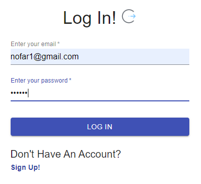
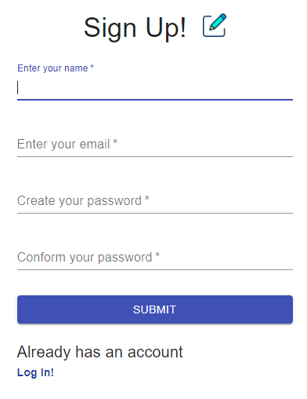
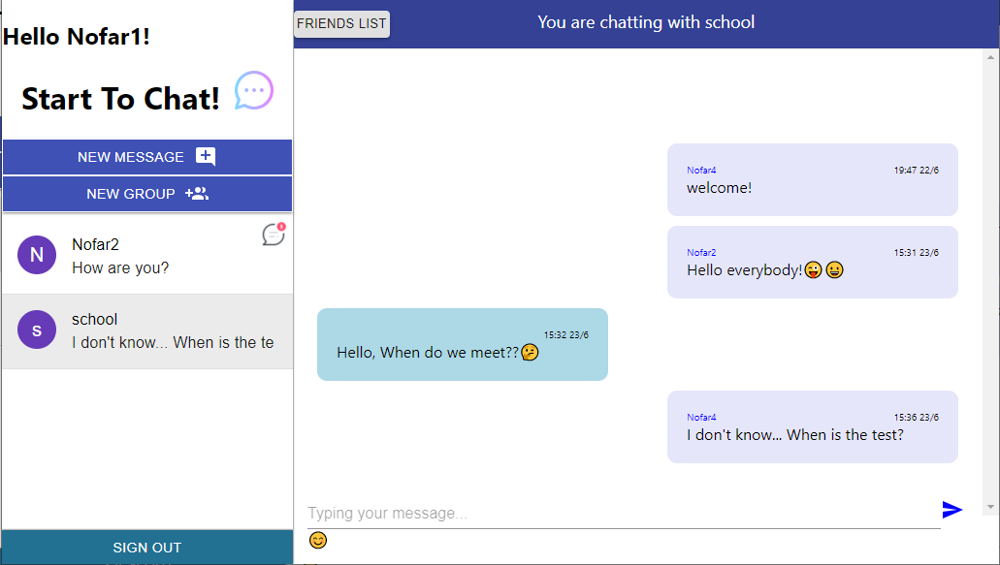

# chat-app

Chat application in **React Router**.
Any user can subscribe to the app by an authentication page and as long as he is logged in, 
he can correspond with someone privately or in a group.
All data is stored in **Firebase**, including users and messages data.

Any user can:
* chat in private/group
* send a new message to any user who registers for the application.
* delete chat
* create new group.

Manager can:
* add users
* delete users
* replace manager

Link to my project https://nofar-ch.github.io/chat-app/

 
<kbd></kbd>
<kbd></kbd>
 
 
<kbd></kbd>
